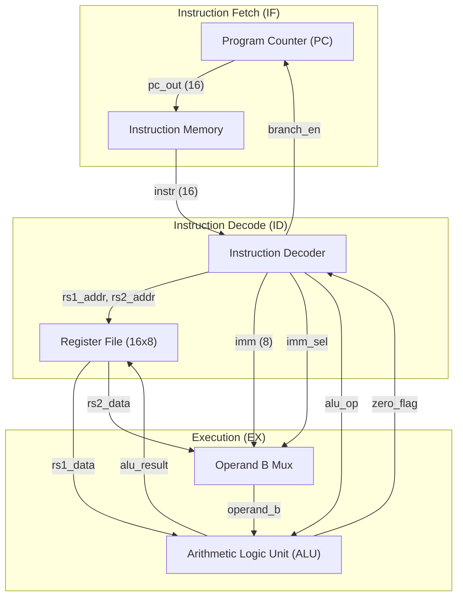
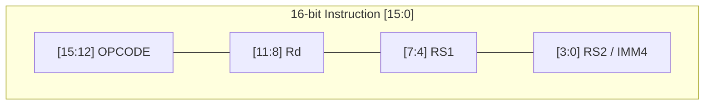
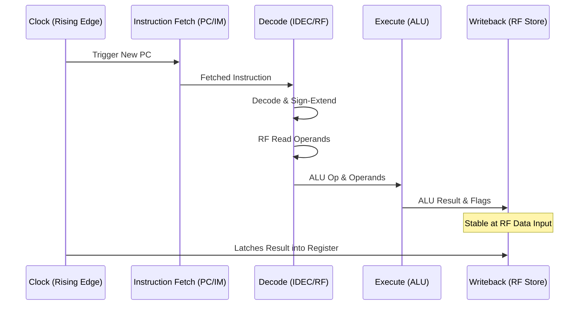

# NanoCore16 Microarchitecture Specification

This document provides a detailed technical overview of the **NanoCore16** internal design, module connectivity, and control signal flow.

## 1. System Block Diagram

The processor follows a classic single-cycle MIPS-like architecture, adapted for an 8-bit datapath and 16-bit instructions.

### 2.0 Instruction Format Visualization

The following diagram illustrates how the 16-bit instruction is sliced for different types of operations.

---

## 3. Timing & Execution Sequence

Since this is a single-cycle processor, all actions occur within one clock period. The following sequence diagram represents the logical flow of data through the modules relative to the clock trigger.

### 2.1 Program Counter (`program_counter`)
- **Storage**: 16-bit register.
- **Next-PC Logic**:
  - `branch_en == 0`: `PC_next = PC + 1`.
  - `branch_en == 1`: `PC_next = branch_target`.
- **Reset**: Active-low asynchronous reset sets `PC = 16'h0000`.

### 2.2 Instruction Memory (`instruction_mem`)
- **Structure**: Read-only memory initializing from `inst_mem.hex`.
- **Addressing**: 16-bit word-aligned addresses (uses lower 8 bits for 256-word depth).
- **Latency**: Combinational read (address in → instruction out).

### 2.3 Instruction Decoder (`instruction_decoder`)
- **Logic**: Purely combinational.
- **Immediate Handling**: Sign-extends 4-bit `IMM4` to 8-bit.
- **Control Signal Generation**:
  - `alu_op`: Mapped from opcode to ALU function.
  - `reg_wr_en`: Disabled for `NOP`, `CMP`, `BEQ`, `BNE`, `JMP`.
  - `imm_sel`: Selects between Register `RS2` and signed `IMM`.
  - `branch_en`: Asserted for `JMP` or when conditional branch criteria (`BEQ + Zero` / `BNE + !Zero`) are met.

### 2.4 Register File (`register_file`)
- **Storage**: 16 registers of 8 bits each.
- **Ports**: 2 asynchronous read ports, 1 synchronous write port.
- **R0 Special Case**: Hardwired to `8'h00`. Reads ignore memory, writes are blocked.

### 2.5 ALU (`alu`)
- **Operations**: ADD, SUB, AND, OR, XOR, INV, SHL, SHR, Pass-A, Pass-B.
- **Flags**:
  - `zero_flag`: High if `alu_result == 8'h00`.
  - `carry_flag`: High on overflow for ADD or borrow for SUB.

---

## 4. Control Signal Matrix

| Mnemonic | `reg_wr_en` | `imm_sel` | `branch_en` | ALU Op | Destination |
|----------|-------------|-----------|-------------|--------|-------------|
| ADD      | 1           | 0         | 0           | ADD    | RS1 + RS2   |
| SUB      | 1           | 0         | 0           | SUB    | RS1 - RS2   |
| ADDI     | 1           | 1         | 0           | ADD    | RS1 + IMM   |
| AND      | 1           | 0         | 0           | AND    | RS1 & RS2   |
| LDI      | 1           | 1         | 0           | PASS_B | IMM         |
| CMP      | 0           | 0         | 0           | SUB    | None        |
| JMP      | 0           | 1         | 1           | ADD    | (RS1 + IMM) |
| BEQ      | 0           | 1         | Zero        | None   | (PC + IMM)  |

---

## 5. Datapath Timing
1. **Rising Edge**: PC updates to new value.
2. **Phase 1 (Fetch)**: Memory fetches instruction.
3. **Phase 2 (Decode)**: Signals propagate through Decoder; RF fetches operands.
4. **Phase 3 (Execute)**: ALU computes result and flags.
5. **Phase 4 (Writeback)**: Result is stable at RF write port.
6. **Next Rising Edge**: PC updates and RF stores result.
